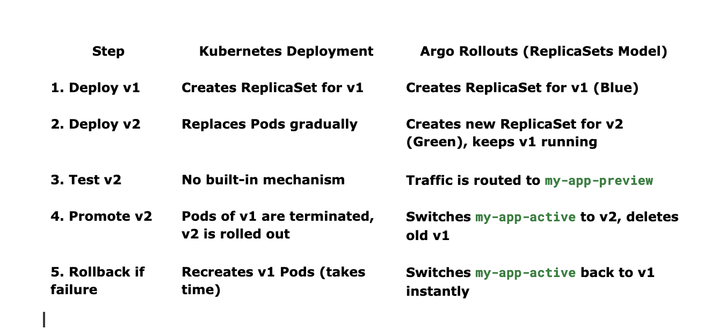

# Below document talks about how to use ARGO rollout method to setup Kubernetes Blue Green Deployment setup 

Argo Rollouts → Blue/Green Deployment 

Progressive traffic shifting, rollback support, dependency is it requires Argo Rollouts setup
Below defines the Argo Rollout resource, replacing the traditional Deployment. It manages Blue-Green deployments with automatic promotion after 24 hours.

Benefits of Using ReplicaSets with Argo Rollouts: 
✔ No Pod downtime when switching between Blue and Green.
✔ Immediate rollback (old ReplicaSet is always ready).
✔ Allows manual approvals before promotion.
✔ Seamless traffic switching via active/preview services.

```
Issues with Deployment:
No parallel Blue-Green versions.
Rollbacks require recreating Pods.
Traffic shifting is not immediate.

Argo Rollouts with ReplicaSets (Blue-Green)
Argo Rollouts keeps two ReplicaSets at the same time.
It manages traffic switching via activeService and previewService.
If the new version fails, rollback is instant (old ReplicaSet is still live).
```

Below is the folder structure for the sample app
```
my-app/
│── charts/
│── templates/
│   ├── rollout.yaml
│   ├── service-active.yaml
│   ├── service-preview.yaml
│   ├── argocd-application.yaml
│── values.yaml
│── Chart.yaml
```

# Deployment model with ArgoRollout feature

Argo Rollouts manages ReplicaSets directly, keeping two versions active at the same time (Blue & Green), allowing immediate rollbacks, traffic shifting, and manual approvals.


🚀 Key Takeaways
✔ Argo Rollouts uses a single Rollout resource to manage ReplicaSets directly (no Deployments required).
✔ Blue-Green deployments are controlled by activeService & previewService, making traffic switching instant.
✔ Rollbacks are instant since the old ReplicaSet is still running.
✔ Rolling updates (Deployments) cause downtime, while Argo Rollouts prevents it.

Would you like an example of manual approval before switching to Green using Argo Rollouts? 🚀

# Deployment Flow:
